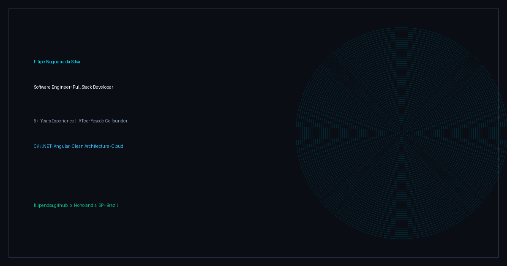

# Filipe Nogueira da Silva — Software Engineer Portfolio

<p align="center">
  <a href="https://filipendsa.github.io/">
    
  </a>
</p>

<p align="center">
  <a href="https://filipendsa.github.io/"></a>
  <a href="https://www.linkedin.com/in/filipe-nogueira07/"></a>
  <a href="https://yesode.com"></a>
  
  
  
</p>

---

## 📌 Visão Geral

Portfólio de engenharia de software moderno, de alto desempenho e mobile-first. Desenvolvido em **React 19**, **TypeScript** e **Vite**, o projeto adota os princípios de **Screaming Architecture**, **Clean Code** e design modular, além de um sistema de internacionalização (**i18n**) nativo e ultraleve com suporte a 3 idiomas (**EN / PT / ES**).

Hospedado e distribuído continuamente via **GitHub Pages** por meio de **GitHub Actions**.

---

## ✨ Principais Funcionalidades

- **Design de Alta Fidelidade & Dark Aesthetics**: Tipografia monoespaçada marcante ([JetBrains Mono](https://fonts.google.com/specimen/JetBrains+Mono)), interface limpa com bento grids, glow ambiente e tokens de design customizados.
- **Screaming Architecture**: Organização estruturada orientada a casos de uso/funcionalidades (`features/`), facilitando manutenção, clareza e separação de responsabilidades.
- **Client-Side i18n Nativo (Zero Libs)**: Alternador de idiomas instantâneo com persistência no `localStorage` e sincronização do atributo `lang` no HTML.
- **Duração de Carreira Dinâmica**: Cálculo automatizado dos anos de experiência profissional atualizado em tempo real.
- **Projetos & Artigos em Destaque**:
  1. **7you App (IATec)**: Ecossistema corporativo de RH e gestão de carreiras para milhares de usuários (.NET, Angular, CQRS).
  2. **Yesode Platform**: Empresa de engenharia de software sob medida e SaaS proprietários fundada por Filipe.
  3. **Clean Architecture .NET 8 Boilerplate**: Padrões de mercado em DDD, CQRS com MediatR e pipeline de testes automatizados.
  4. **Veículo Autônomo para Logística (UNASP / ENAIC)**: Pesquisa científica publicada com robótica móvel e fusão sensorial.
- **SEO Completo & Acessibilidade**: Meta tags Open Graph, Twitter Cards, dados estruturados Schema.org (`Person` JSON-LD), `sitemap.xml` e `robots.txt`.

---

## 🛠️ Tecnologias & Ferramentas

| Categoria | Tecnologias |
| :--- | :--- |
| **Frontend Core** | React 19, TypeScript (Strict Mode), Vite 6 |
| **Estilização** | CSS3 Vanilla, Variáveis CSS (Design Tokens), Flexbox, CSS Grid |
| **Tipografia** | JetBrains Mono & Plus Jakarta Sans |
| **Internacionalização** | i18n nativo sob Context API + Custom Hooks |
| **CI/CD & Deploy** | GitHub Actions (`deploy.yml`) ➔ GitHub Pages |

---

## 🏗️ Estrutura Arquitetural (Screaming Architecture)

```text
src/
├── app/               # Raiz de composição e contexto global
│   ├── providers/     # Providers da aplicação (ex: I18nProvider)
│   └── App.tsx        # Montagem das seções
├── domain/            # Regras e modelos de dados do portfólio
│   ├── experience/    # Cálculo e regras de tempo de carreira
│   ├── hero/          # Dados do carrossel em destaque
│   └── projects/      # Estrutura e listagem dos projetos
├── features/          # Funcionalidades e seções (Screaming Architecture)
│   ├── hero/          # Seção inicial, título e social pills
│   ├── about/         # Biografia e foto de perfil
│   ├── skills/        # Bento grid de competências técnicas
│   ├── experience/    # Linha do tempo profissional e educação
│   ├── projects/      # Vitrine de projetos e casos de estudo
│   ├── research/      # Artigo publicado no ENAIC
│   └── contact/       # Formulário com FormSubmit e dados de contato
└── shared/            # Elementos reutilizáveis transversais
    ├── components/    # Botões, Header, Footer e marcadores de UI
    ├── i18n/          # Dicionários de tradução (en, pt, es)
    └── styles/        # index.css (tokens de design e variáveis)
```

---

## 🚀 Como Rodar Localmente

### Pré-requisitos
- **Node.js** (v20 ou superior recomendado)
- **npm** ou gerenciador de pacotes equivalente

### Instalação e Execução

```bash
# 1. Clone o repositório
git clone https://github.com/Filipendsa/filipendsa.github.io.git

# 2. Acesse o diretório
cd filipendsa.github.io

# 3. Instale as dependências
npm install

# 4. Inicie o servidor de desenvolvimento
npm run dev
```

Abra no navegador em: `http://localhost:5173`

### Compilação de Produção

```bash
# Checagem de tipagem com tsc e geração do bundle otimizado em dist/
npm run build

# Pré-visualização do bundle gerado
npm run preview
```

---

## ⚙️ Deploy Contínuo (CI/CD)

O deploy é executado automaticamente a cada push na branch `main` pelo GitHub Actions:

- **Workflow**: `.github/workflows/deploy.yml`
- **Etapas**:
  1. Checkout do código
  2. Setup do Node.js v20 com cache do npm
  3. `npm ci` e `npm run build`
  4. Upload do diretório `./dist` como artifact
  5. Publicação no **GitHub Pages**

> **Importante:** Nas configurações do repositório (**Settings > Pages**), certifique-se de que a opção **Source** está definida como **GitHub Actions**.

---

## 📬 Contato & Redes

- **Website**: [filipendsa.github.io](https://filipendsa.github.io/)
- **LinkedIn**: [in/filipe-nogueira07](https://www.linkedin.com/in/filipe-nogueira07/)
- **Co-Founder**: [yesode.com](https://yesode.com)
- **E-mail**: [filipe.nogueira@yesode.com](mailto:filipe.nogueira@yesode.com)
- **WhatsApp**: [+55 (19) 98416-0295](https://wa.me/5519984160295)
- **Localização**: Hortolândia - SP, Brasil

---

<p align="center">
  <sub>Desenvolvido com precisão · React, TypeScript & Screaming Architecture</sub>
</p>
